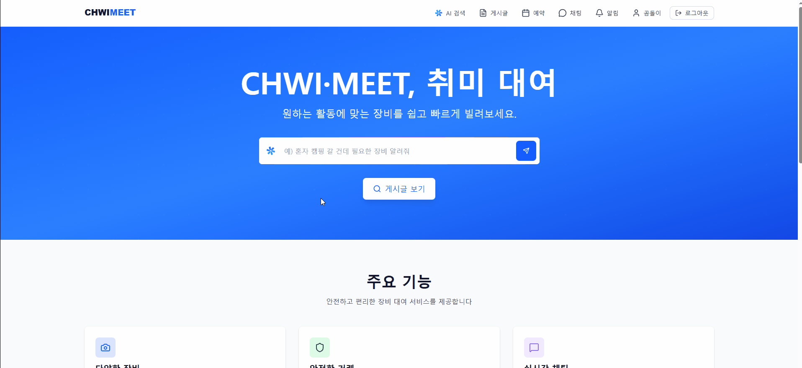

#  CHWIMEET

<div align="center">
<div align="center">
  
</div>

**“장비가 이어주는 취미의 시작”**

> 장비를 통해 **새로운 취미를 시작하고**,  
> 장비를 가진 사람과 **즐겁게 연결되는 플랫폼, 취밋**  
>  
> 시작하고 싶은 취미와  
> 사용되지 않던 장비가  
> 취밋에서 만나 새로운 즐거움을 만들어갑니다.

[🖥️ 서비스 바로가기](https://www.chwimeet.store/) ·
[🛠️ API 문서 (Swagger)](https://api.chwimeet.store/)

</div>


<br>

#  📖 목차

1. [🧑‍💻 팀 소개](#-팀-소개-—-일단-진행해-팀)
2. [💡 개발 배경](#-개발-배경)
3. [🧩 아키텍처](#-아키텍쳐)
4. [🚀 기능 소개](#-기능-소개)
5. [🛠️ 기술 스택](#️-기술-스택)
6. [⚙️ 기능 구현 방식](#️-기능-구현-방식)
7. [🔥 트러블슈팅](#-트러블-슈팅)

<br>

# 🧑‍💻 팀 소개 — 일단 진행해 팀

| [](https://github.com/Yoepee) | [](https://github.com/ehgk4245) | [](https://github.com/jjuchan) | [](https://github.com/kku1403) | [](https://github.com/geun-00) | [](https://github.com/1J-Choi) |
|--------------------------------------------------------------------------------------|----------------------------------------------------------------------------------------|----------------------------------------------------------------------------------------|----------------------------------------------------------------------------------------|----------------------------------------------------------------------------------------|----------------------------------------------------------------------------------------|
| <p align="center">김동엽<br/>BE/FE</p> | <p align="center">김도하<br/>BE</p> | <p align="center">윤주찬<br/>BE</p> | <p align="center">김은주<br/>BE</p> | <p align="center">장근영<br/>BE</p> | <p align="center">최원제<br/>BE</p> |

<br>

# 💡 개발 배경

우리 주변에는 한두 번만 사용하고 방치되는 물건들이 정말 많습니다.  
캠핑 장비, 공구, 촬영 장비처럼 **자주 쓰지 않지만 필요할 때는 꼭 필요한 물건들**이 대표적입니다.  
이런 물건들을 사기에는 부담되고, 보관도 번거롭고, 그렇다고 한 번 쓰자고 구매하기도 아깝습니다.

그래서 많은 사람들은 친구나 지인에게 빌리려고 해보지만,  
**누가 어떤 물건을 가지고 있는지 알기 어렵고**,  
빌리고 돌려주는 과정에서도 생각보다 많은 불편이 생깁니다.

> **“잠깐만 필요한 물건, 이웃에게 편하게 빌릴 수 있다면 어떨까?”**  
> **“서랍 속에 놀고 있는 물건들을, 필요한 사람들에게 자연스럽게 공유할 수는 없을까?”**

만약 그런 환경이 마련된다면, 물건을 둘러싼 소비는 훨씬 더 가볍고 효율적이 될 것입니다.  
구매 부담은 줄고, 집 안에 쌓여가는 물건도 줄어들며,  
이웃 간의 연결과 신뢰가 자연스럽게 생겨나는 경험도 가능해집니다.

저희는 많은 사람들이 일상 속에서 느끼는 이 **작지만 반복적인 불편함과 아쉬움**을 기술로 해결해보고자,  
이 P2P 물건 대여 플랫폼을 기획하게 되었습니다.


<br>

# 🧩 아키텍쳐
- 아키텍처 이미지
<div align="center">

</div>

- 주요 아키텍처 특징
  - 실시간 모니터링: Grafana 대시보드를 통한 실시간 시스템 메트릭 모니터링 및 알림
  - 무중단 배포: Nginx Proxy Manager를 활용한 Blue/Green 배포 전략으로 서비스 중단 없이 안전한 배포 구현
  - 이미지 최적화: AWS Lambda를 통한 서버리스 이미지 리사이징으로 메인 서버 부하 분산 및 비용 효율화
  - 분산 캐싱: Redis를 활용한 세션 관리 및 캐싱으로 서버 간 데이터 일관성 유지

<br>

# 🚀 기능 소개

<!-- 게시글 -->
<details>
<summary>📝 게시글</summary>

### 게시글 조회


- 게시글 목록 조회 기능
- 카테고리, 지역, 키워드 기준 검색 가능

### 게시글 상세 조회


- 게시글 상세 정보 조회
- 호스트(작성자) 정보, 게시글 이미지, 본문 내용 제공
- 추가 옵션 및 리뷰 정보 함께 조회

### 게시글 등록


- 게시글 기본 정보 및 이미지 업로드 기능
- 이미지 업로드 시 AWS Lambda를 통해 리사이징 처리
- 처리된 이미지는 S3에 저장되며 CloudFront를 통해 캐싱

</details>

<!-- AI -->
<details>
<summary>🤖 AI</summary>

### AI 검색


- 게시글 데이터를 임베딩하여 벡터 형태로 저장
- MariaDB Vector 기반 1차 유사도 검색 수행
- reranker를 통한 재정렬 
- LLM이 답변을 생성하는 2-stage RAG 구조 적용

### 게시글 자동 생성


- 이미지를 기반으로 게시글 내용 생성
- 이미지를 분석하여 제목, 내용, 카테고리, 가격, 옵션 정보 작성
- 첫 번째 사진을 메인 물건으로 인식
- 이후 사진들에서 다른 물건으로 인식될 시 옵션으로 내용 추가
- 사용자로 부터 이미지 외에도 추가적인 정보를 텍스트로 입력받을 수 있도록 설계

### AI 후기 요약


</details>

<!-- 예약 -->
<details>
<summary>📅 예약</summary>

### 예약 목록 조회

.gif)

- 내 게시글의 예약 목록 조회 (호스트)
- 내 예약 목록 조회 (게스트)
- 예약의 상태 및 권한에 따른 변경 기능 제공

### 예약 상세 조회


- 예약 기본 정보, 상태 변경 로그, 배송 정보 제공

### 예약 등록


- 게시글 기반 예약 등록 (날짜, 옵션, 수령/반납 방식 선택 가능)
  - 예약이 진행중인 기간은 차단하여 중복 예약 방지

### 예약 내용 수정


- 예약이 승낙되기 전 게스트가 예약 내용 수정 가능

### 예약 상태 변경


- 예약의 흐름에 따라 게스트, 호스트 또는 시스템이 상태 변경 가능

### 예약 결재


- 예약이 승인 된 후(결제 대기 상태) 게스트가 결제 진행 (tossPayments API 연동)
- 결제 완료 시 예약의 상태가 자동으로 넘어감

</details>

<!-- 후기 -->
<details> <summary>⭐ 후기</summary>

### 후기 작성


- 일정 단계 이상 진행 된 예약에 대하여 후기 작성가능

### 후기 통계


- 사용자가 등록한 게시글에 대한 사용자 후기 통계 기능
- 단일 게시글에 대한 후기 통계 기능

</details>


<!-- 채팅 -->
<details>
<summary>💬 채팅</summary>

<div align="center">
  
</div>

<br>

- 게시글을 통해 호스트와 채팅방 생성
- 실시간 통신

</details>

<!-- 알림 -->
<details>
<summary>🔔 알림</summary>

### 알림 기능


- 이벤트 알림 제공
- SSE 기반 실시간 알림

</details>

<!-- 신고 -->
<details>
<summary>🚨 신고</summary>

- 게시글, 댓글, 후기 신고 가능
- 관리자가 확인 후 처리
- 알림과 연동되어 신고 처리 결과 확인 가능

</details>

<!-- 관리자 -->
<details>
<summary>⚙️ 관리자</summary>

### 지역 관리 기능


- 등록된 지역 목록 조회
- 지역 등록, 수정, 삭제

### 카테고리 관리 기능


- 등록된 카테고리 목록 조회
- 카테고리 등록, 수정, 삭제

### 신고 목록 확인 및 제제 기능


- 사용자가 등록한 신고 목록 조회
- 제제 버튼으로 제제할 수 있는 기능

</details>

<br>

<br>

# 🛠️ 기술 스택

## Frontend

<div>
  
  
  
  
  
    
  
  
</div>

## Backend

<div>
  
  
  
  
  
  
  
  
</div>

## Database

<div>
  
  
  
  
  
</div>

## Test & Monitoring

<div>
  
  
  
  
</div>


## Infra

<div>
  
  
  
  
  
  
  
  
  
</div>

## Communication

<div>
  
  
  
</div>

## ETC

<div>
  
  
  
  
</div>

<br>

<details>
  <summary><b>MariaDB를 선택한 이유</b></summary>

프로젝트 초기에는 익숙한 관계형 데이터베이스인 MySQL을 사용했지만,
검색 정확도 향상과 임베딩 기반 분류 기능을 구현하기 위해 **벡터 검색(Vector Search)** 이 필요한 상황이 되었습니다.

외부 Vector Database(Pinecone, Qdrant, Weaviate 등)도 검토했으나,
별도의 솔루션을 도입할 경우 운영 복잡성 증가, 데이터 동기화 문제, 인프라 비용 상승이 발생할 가능성이 컸습니다.

MariaDB는 기존 MySQL 계열의 장점을 유지하면서도 벡터 타입과 벡터 인덱스 기능을 공식 지원해
관계형 데이터와 벡터 데이터를 하나의 DB에서 통합 관리할 수 있었습니다.
이로써 추가 인프라 없이 필요한 기능을 확장할 수 있었고, 데이터 일관성도 자연스럽게 유지할 수 있었습니다.

또한 Spring 기반의 프로젝트였기 때문에,
Spring AI에서 MariaDB Vector Store를 기본적으로 지원한다는 점이 큰 이점으로 작용했습니다.
즉, 복잡한 커넥터 구현 없이도 임베딩 저장·조회·검색 기능을 기존 Spring Data 스타일로 바로 사용할 수 있어
개발 속도와 유지보수성이 크게 향상되었습니다.

</details>

<details>
  <summary><b>Spring AI를 선택한 이유</b></summary>

Spring AI는 다양한 AI 모델과 벡터 DB를 추상화된 인터페이스로 제공하여 **특정 벤더나 기술에 종속되지 않고 유연한 확장**이 가능합니다. 또한 **RAG 파이프라인**을 지원하여 임베딩 및 검색, 응답 생성 구조를 쉽고 빠르게 구축할 수 있습니다. 결과적으로 Spring 생태계와의 결합, 유지보수성과 확장성, 그리고 RAG를 효율적으로 개발하기 위해 Spring AI를 선택하였습니다.

</details>

<details>
  <summary><b>Redis를 선택한 이유</b></summary>

채팅 기능을 분산 환경에서도 안정적으로 동작하게 하기 위해 Redis를 도입했습니다. 여러 서버 인스턴스가 동시에 운영되는 환경에서는 단일 서버만으로는 실시간 메시지 전달과 사용자 간 동기화를 보장하기 어렵기 때문에, Redis Pub/Sub을 활용하여 서버 간 메시지를 효율적으로 브로드캐스트하도록 구현했습니다. 이를 통해 어느 서버에 연결된 사용자라도 동일한 채팅 메시지를 즉시 수신할 수 있게 되었으며, 서버 간 메시지 동기화를 Redis에 위임함으로써 구현 복잡도를 줄이고 서버 부담을 최소화할 수 있었습니다. 또한, Redis의 빠른 메시지 전달 특성 덕분에 채팅 서비스의 실시간성을 확보할 수 있었고, 향후 서버 확장(Scale out)에도 유연하게 대응할 수 있는 구조를 마련할 수 있었습니다.

또한 레디스를 캐시 저장소로 사용하였는데, 이는 이미 STOMP Pub/Sub 구조에서 레디스가 구축된 상황에서 도입 비용과 운영 복잡도를 줄이기 위함이었습니다. 그리고 레디스를 단순 캐시 용도가 아니라, **Redisson을 활용한 분산락**을 적용함으로써 다중 인스턴스에서 발생할 수 있는 **캐시 스탬피드 현상**을 제어할 수 있었습니다. 즉, 캐싱을 통한 성능 개선과 분산락을 통한 최적화 및 데이터 정합성 확보를 동시에 만족하기 위해 레디스를 선택하였습니다.

</details>

<details>
  <summary><b>Quartz를 선택한 이유</b></summary>
  프로젝트에서는 게시글 임베딩, 예약 상태 자동 변경, 오래된 알림 삭제 등
주기적으로 처리해야 하는 작업들이 필요했습니다.

Spring의 `@Scheduled`로도 가능했지만, Blue/Green 배포 시 배치 작업이 중복 실행될 위험과
작업 이력 관리의 어려움 때문에 Quartz를 선택했습니다.

Quartz는 데이터베이스 기반 분산 락으로 여러 인스턴스 환경에서도
배치 작업이 한 번만 실행되도록 보장하며, 작업 실행 이력을 자동으로 기록합니다.
</details>

<details>
  <summary><b>Jooq를 선택한 이유</b></summary>
  동일 조건 게시글 작성자별 리뷰 통계를 조회하는 테스트(워밍업 50건, 측정 1,000건)에서 jOOQ가 QueryDSL 대비 성능적으로 우수함을 확인했습니다. 이에 따라 JPA는 엔티티 중심 설계와 변경 감지·연관관계 관리가 필요한 도메인 로직과 CRUD에, QueryDSL은 기존 엔티티 기반 코드와 통합하며 타입 안전한 복잡한 검색과 동적 쿼리에, jOOQ는 SQL을 거의 그대로 작성하면서 DB 특화 기능을 활용하고 SQL 튜닝에 직접 개입할 수 있는 통계/리포팅과 성능이 중요한 읽기 작업에 사용하는 하이브리드 전략을 선택했습니다. 
</details>

<br>


# ⚙️ 기능 구현 방식

<details>
<summary><strong>💬 Redis Pub/Sub 기반 실시간 채팅</strong></summary>

<br>

### 도입 배경
단일 서버 환경에서는 WebSocket 기반 채팅만으로도 충분했지만,   
**미래의 서버 확장**을 고려하면서 서버 환경에서 발생할 수 있는 메시지 전달 문제를 인지했습니다.

예를 들어, 같은 채팅방 사용자라도 서로 다른 서버에 연결될 경우 메시지가 전달되지 않는 상황이 발생할 수 있었습니다.

이를 해결하기 위해 Redis Pub/Sub을 메시지 브로커로 활용하는 구조를 도입했습니다.

---

### 구조 및 동작 방식
채팅 메시지는 다음 흐름으로 처리됩니다.

```
사용자
  │
  ▼
[WebSocket 서버] 
  │
  ▼
[Redis Channel] ── 브로드캐스트 ──> [다른 서버 인스턴스]
  │                                  │
  ▼                                  ▼
사용자                             사용자

```
1. 사용자가 채팅 메시지를 전송하면  
   → WebSocket을 통해 현재 연결된 서버로 전달됩니다.
2. 서버는 해당 메시지를 Redis Channel로 Publish 합니다.
3. Redis는 메시지를 해당 채널을 구독 중인 모든 서버 인스턴스에 브로드캐스트합니다.
4. 각 서버는 Redis로부터 전달받은 메시지를  
   → 자신에게 연결된 클라이언트들에게 WebSocket으로 다시 전송합니다.

이를 통해 **어느 서버에 연결되어 있든 동일한 채팅 메시지를 실시간으로 수신**할 수 있습니다.

---

### 설계 시 고려한 점
채팅 메시지는 Redis Pub/Sub을 통해 전달되기 전에
이미 데이터베이스에 저장되는 구조입니다.

따라서 Redis는 메시지 영속성을 담당하지 않으며, 
실시간 전달 및 서버 간 동기화 역할에 집중하도록 설계했습니다.  

또한 Redis Publish 과정에서 예외가 발생할 경우를 대비해,
WebSocket을 통해 현재 서버에 연결된 클라이언트에게
직접 메시지를 전달하는 fallback 로직을 추가했습니다.

```java
public void publish(Long chatRoomId, ChatMessageDto dto) {
    try {
        // 정상 동작 시 Redis Publish 동작
        ...

    } catch (Exception e) {
        // Redis Publish 실패 시 fallback 
        log.error("Failed to publish chat message: chatRoomId={}, messageId={}",
                chatRoomId, dto.id(), e);
        chatWebsocketService.broadcastMessage(chatRoomId, dto);
    }
}
```
이를 통해 일부 인프라 장애 상황에서도 
채팅 기능이 완전히 중단되지 않도록 구성했습니다.

</details>

<details>
<summary><strong>📝 Quartz 기반 배치 기능 구현</strong></summary>

### 도입 배경
주요 MVP 기능들을 개발하며 주기적으로 자동 처리해야 하는 작업들이 요구되었습니다.

**주요 자동화 작업**
- **게시글 임베딩**: 작성 즉시 처리하면 사용자 대기 시간이 길어지므로, 백그라운드에서 주기적으로 처리
- **예약 상태 자동 변경**: 청구진행 → 청구완료, 환급예정 → 환급완료 등 시간 기반 상태 전환
- **오래된 알림 삭제**: 7일 이상 확인하지 않은 알림을 자동으로 정리하여 DB 부담 감소
- **신고 누적 자동 제재**: 일정 기준 이상 신고가 누적된 사용자를 자동으로 제재

---

### 구조 및 동작 방식

**Quartz 클러스터 모드 활용**

Quartz는 데이터베이스 기반으로 여러 서버 인스턴스가 작업 정보를 공유하며,  
분산 락을 통해 동일한 작업이 중복 실행되지 않도록 보장합니다.

특히 Blue/Green 배포 시 잠시 두 인스턴스가 동시에 실행되는 순간에도,  
배치 작업은 한 번만 수행되므로 데이터 정합성을 유지할 수 있습니다.

**구현된 배치 작업**

| 작업명 | 실행 주기    | 목적 |
|--------|----------|------|
| 게시글 임베딩 | 매 시간 정각  | 사용자 응답 속도 개선 |
| 예약 상태 변경 | 매 오후 5시  | 예약 프로세스 자동화 |
| 알림 정리 | 매일 오후 5시 | 데이터베이스 용량 관리 |
| 자동 제재 처리 | 매일 오후 5시 | 서비스 품질 유지 |

**작업 등록 및 관리**

각 배치 작업은 애플리케이션 시작 시 Quartz 스케줄러에 자동으로 등록되며,  
이미 등록된 작업이 있다면 기존 설정을 유지하거나 업데이트합니다.

---

### 설계 시 고려한 점

**배포 안정성**

Blue/Green 배포 중 배치 작업이 실행되더라도,  
Quartz의 분산 락 메커니즘으로 인해 한 번만 수행됩니다.  
이를 통해 배포 과정에서도 데이터 정합성을 보장할 수 있습니다.

**작업 독립성**

각 배치 작업을 독립적으로 구성하여,  
특정 작업에서 오류가 발생해도 다른 작업에 영향을 주지 않도록 설계했습니다.

**실행 이력 관리**

Quartz는 각 작업의 실행 시간, 성공/실패 여부를 데이터베이스에 자동으로 기록하므로,  
문제 발생 시 빠르게 원인을 파악하고 대응할 수 있습니다.

</details>

<details>

<summary><strong>🔍 2-Stage-RAG 기반 AI 게시글 검색</strong></summary>
  
## 도입 배경

기존 방식은 Spring AI의 text-embedding-3-small으로 임베딩한 후 코사인 유사도를 기반으로 벡터 검색을 수행하고, 그 결과를 답변 LLM에 전달해 설명을 생성하는 구조였습니다. 하지만 벡터 검색만으로는 문장 유사도는 높지만 질문 의도와 맞지 않는 게시글까지 조회되는 문제가 발생했습니다.

즉, **검색은 가능했지만 질문에 정말 필요한 게시글만 선별하지는 못하는 구조**였습니다.

## 해결 방식 -> Re-Ranker 모델 추가로 필터링 퀄리티 강화

### 1단계: Retrieve (Vector Search)

```java
List<Long> candidatePostIds = postVectorService.searchPostIds(query, 5);
```

MariaDB Vector를 활용해 코사인 유사도 기반으로 top-5 후보군을 빠르게 조회합니다.

**MariaDB Vector 선택 이유**

> 기존 서비스에서 이미 MySQL(MariaDB 계열)을 사용하고 있었기 때문에, Chroma나 Qdrant와 같은 별도의 벡터 DB를 도입할 경우 Python 서버 또는 전용 검색 서버를 추가로 운영해야 하는 부담이 있었습니다. 이에 따라 기존 데이터베이스와 바로 호환되며, 추가 인프라 구성 없이 벡터 검색 기능을 도입할 수 있는 MariaDB Vector 기능을 선택했습니다.

### 2단계: Re-Rank (LLM 필터링)

```java
String prompt = rerankPrompt.formatted(context, query);
String raw = rerankerClient.prompt(prompt).call().content();
List<Long> recommendedIds = parseJsonIdList(raw);
```

GPT-4.1 mini를 통해 1차 후보들을 직접 검토하여 질문과 실제로 관련 있는 게시글만 선별합니다.

- LLM에는 유연한 검색을 위해 게시글의 제목, 카테고리, 가격, 거래 방식, 지역 정보를 컨텍스트로 전달했습니다.
- 단순 텍스트 유사도가 아닌 실제 거래 조건을 기준으로 판단하도록 구성했습니다.

### 3단계: Answer (최종 응답)

```java
String prompt = answerPrompt.formatted(query, context);
return answerClient.prompt(prompt).call().content();
```

Re-Rank를 통과한 게시글만으로 GPT-5.1을 이용해 최종 응답을 생성합니다.
</details>

<details>
<summary><strong>📸 AWS Lambda + CloudFront 기반 이미지 리사이징 & 캐싱</strong></summary>

## 도입 배경

게시글 이미지(목록, 상세, 썸네일)와 멤버 프로필 이미지(채팅, 게시글 작성자 정보 등)가 자주 노출되면서 다음과 같은 문제가 발생했습니다.

**초기 방식 (원본 이미지 그대로 제공)**
- 고용량으로 인한 응답 지연
- 동일 이미지의 반복 요청으로 인한 트래픽 증가

**개선 시도 (Thumbnailator로 서버 리사이징)**
- 용량은 줄었으나, 서버에서 리사이징을 처리해 업로드하는 구조
- 사진 5장 정도만 되어도 리사이징 작업으로 응답 속도가 급격히 저하

이에 따라 **이미지 처리 책임을 서버 외부로 완전히 분리하면서도, 반복 요청 성능을 보장하는 구조**가 필요했습니다.

## 해결 방식 -> 이미지 업로드시 AWS Lambda로 리사이징 및 CloudFront 캐싱

### 이미지 처리 흐름

1. 사용자가 이미지를 업로드하면 원본 이미지를 S3에 저장하고, **CloudFront URL을 데이터베이스에 저장**합니다.
2. S3 업로드 이벤트를 트리거로 AWS Lambda가 실행됩니다.
3. Lambda에서 이미지 유형에 따라 리사이징을 수행합니다.
   - **프로필 이미지**: 원본 + 썸네일
   - **게시글 이미지**: 원본 + 썸네일(목록용) + 상세보기 이미지
4. 리사이징된 이미지들을 각각 S3에 저장합니다.
5. 클라이언트는 CloudFront를 통해 용도에 맞는 이미지를 캐싱된 상태로 전달받습니다.

### AWS Lambda 리사이징 

```javascript
const SIZES = {
    thumbnail: { width: 800, height: 600 },
    detail: { width: 1920, height: 1440 }
};

// 각 크기별 리사이징
for (const [sizeName, dimensions] of Object.entries(SIZES)) {
    const resizedImage = await sharp(imageBuffer)
        .resize(dimensions.width, dimensions.height, {
            fit: 'cover',
            position: 'centre'
        })
        .webp({ quality: 85, effort: 6 })
        .toBuffer();
    
    const destinationKey = `posts/images/resized/${sizeName}/${nameWithoutExt}.webp`;
    
    // S3에 업로드
    await s3.send(new PutObjectCommand({
        Bucket: bucket,
        Key: destinationKey,
        Body: resizedImage,
        ContentType: "image/webp", //webp로 설정해 용량 경량화
        CacheControl: "max-age=31536000"  // 1년 캐싱
    }));
}
```

### s3 디렉토리 분기

```java
// 원본: posts/images/originals/uuid.jpg
// 리사이즈: posts/images/resized/{sizeType}/uuid.webp
String resizedKey = "posts/images/resized/" + sizeType + "/" + nameWithoutExt + ".webp";
return "https://" + cloudfrontDomain + "/" + resizedKey;
```
원본 업로드 시 Lambda가 자동으로 각 용도별 이미지를 생성하고, 백엔드에서는 단순히 경로 문자열만 조합하여 반환하는 **책임 분리** 구조로 설계했습니다.


## 적용 효과

이미지 리사이징을 AWS Lambda에서 처리하도록 구조를 변경하여, 메인 서버는 단순 업로드/저장 처리만 수행하도록 했습니다. 덕분에 게시글 이미지, 채팅, 멤버 프로필 등 반복 요청이 많은 화면에서도 CloudFront 캐싱과 결합해 빠른 이미지 로딩과 안정적인 응답을 제공할 수 있었습니다.

> - 응답 속도 개선: 5장 기준 이미지 업로드 시 기존 1~2초에서 약 600ms로 단축
> - 트래픽 효율성 강화: 리사이징된 이미지를 캐싱하여 사용자 트래픽 감소
> - 유지보수성과 확장성 확보: 이미지 유형에 관계없이 공통 파이프라인으로 처리

</details>

<details>
<summary><strong>🔔 알림 타입 기준 Batch 로딩과 Mapper 기반 응답 조합을 적용한 알림 조회 설계 </strong></summary>

<br>

### 기능 개요

알림 목록 조회 API는 **페이징·정렬 기준에 따라 하나의 목록으로 조회되지만**,  
목록에 포함된 각 알림은 **알림 타입에 따라 참조해야 하는 엔티티와 응답 구조가 서로 다릅니다.**

이를 단순 조건 분기나 타입별로 분리된 API로 처리하지 않고,  
**목록 조회 성능을 유지하면서도 알림 타입 확장에 유연한 조회 구조**로 설계했습니다.

--- 


### 설계 목표

- **요청 쿼리 최소화**
  - 알림 개수에 비례해 쿼리가 증가하는 N+1 문제 방지
- **확장성 확보**
  - 알림 타입 추가 시 서비스 계층 로직 수정 없이 확장 가능
- **역할 분리**
  - 조회 / 로딩 / 응답 조합 책임을 명확히 분리
 
---


### 처리 흐름

```text
알림 엔티티 페이징 조회
(알림 타입, 연관 엔티티 ID)
        ↓
알림 타입 기준 그룹화
        ↓
그룹별 Batch 조회로 필요한 엔티티 로딩
        ↓
Mapper를 통한 타입별 응답 데이터 매핑
        ↓
  페이징 응답 반환
```
---

### 단계별 핵심 로직

#### 1. 알림 엔티티 페이징 조회

```java
Page<Notification> notificationsPage =
        notificationRepository.findAllByMemberIdOrderByCreatedAtDesc(memberId, pageable);

List<Notification> notifications = notificationsPage.getContent();
```
- 알림 엔티티 페이징 조회
- 알림 ID, 알림 타입 등 기본 정보와 함께 연관 엔티티 ID 조회

---

#### 2. 알림 타입 기준 그룹화

```java
Map<NotificationType.GroupType, List<Long>> groupedTargetIds =
        notifications.stream()
                .collect(Collectors.groupingBy(
                        n -> n.getType().getGroupType(),
                        Collectors.mapping(Notification::getTargetId, Collectors.toList())
                ));
```
- batch 조회를 위한 사전 작업
- GroupType을 Key로, 조회해야 할 연관 엔티티 ID들을 그룹화

---

#### 3. 그룹별 Batch 조회로 연관 엔티티 로딩

```java
for (Map.Entry<NotificationType.GroupType, List<Long>> entry : groupedTargetIds.entrySet()) {
    NotificationType.GroupType groupType = entry.getKey();
    List<Long> targetIds = entry.getValue();

    Function<List<Long>, Map<Long, ?>> loader = batchLoaders.get(groupType);
    if (loader != null) {
      loadedEntities.put(groupType, loader.apply(targetIds));
    }
}
```

- 그룹화 한 Map 정보를 바탕으로 타입 별로 batch 조회
- 알림 개수와 무관하게 타입 수 만큼만 쿼리 발생

---

#### 4. Mapper를 통한 타입별 응답 데이터 매핑

```java
for (Notification notification : notifications) {
    NotificationDataMapper<? extends NotificationData> mapper =
            mapperRegistry.get(notification.getType());

    Map<Long, ?> entityMap =
            loadedEntities.get(notification.getType().getGroupType());
    Object entity =
            entityMap != null ? entityMap.get(notification.getTargetId()) : null;

    NotificationData data = mapper.map(entity, notification);
}

```

---

- Batch 조회 시 DTO로 직접 조회하지 않고 Entity를 로딩한 뒤 Mapper에서 응답 DTO로 변환
- 알림 타입별 응답 구조 변경 시 쿼리 수정 없이 Mapper만 변경 가능

#### 5. 응답 반환

```java
public record NotificationResBody<T extends NotificationData>(
        Long id,
        NotificationType notificationType,
        LocalDateTime createdAt,
        Boolean isRead,
        T data
)
```

- 위 형태의 응답 DTO를 페이징 으로 감싸서 반환
- 하나의 API 응답에서 알림 타입에 따라 서로 다른 데이터 구조를 반환

<br>

---

### 새로운 알림 타입 추가

새로운 알림 타입이 추가되더라도 **기존 조회 로직이나 서비스 계층 코드는 수정하지 않습니다.**  
아래 두 지점만 확장하도록 설계했습니다.

- **Batch 조회 로더 추가**
  - 알림 타입이 참조하는 연관 엔티티를 한 번에 조회하는 로직을 `GroupType` 기준으로 등록

- **알림 타입별 Mapper 추가**
  - 해당 알림 타입의 응답 데이터를 생성하는 `NotificationDataMapper` 구현체만 추가

이 구조를 통해,
- 알림 타입 증가에 따른 **조건 분기 코드 증가를 방지**
- **쿼리 구조와 조회 흐름은 그대로 유지**
- 알림 타입 확장 시 **로딩 로직과 응답 매핑만 분리해서 확장 가능**

결과적으로,  
**조회 성능과 응답 확장성을 동시에 유지할 수 있는 구조**로 알림 조회 API를 설계했습니다.

<br>

</details>

# 🔥 트러블 슈팅

<details>
  
<summary><strong>SSE 도입 후 프론트 API 요청 무한 Pending 발생 문제</strong></summary>

### 문제 상황

실시간 알림 기능을 구현하기 위해 **SSE(Server-Sent Events)** 기반 기능을 추가했습니다.  
SSE 연결 자체는 정상적으로 유지되는 것처럼 보였지만,  
이후 **프론트엔드에서 일반 API 요청을 보내면 응답이 오지 않고 무한 Pending 상태**에 빠지는 문제가 발생했습니다.

서버는 정상적으로 실행 중이었고,  
프론트에서는 요청이 전송되었지만 응답을 받지 못하는 상태였습니다.

<br>

### 원인 분석 과정

#### **1. 서버 로그 확인**

- 서버 로그를 확인한 결과  
  **DB 커넥션 풀 고갈(Connection Pool Exhausted)** 관련 로그가 발생하는 것을 확인했습니다.
- 새로운 API 요청이 들어와도  
  DB 커넥션을 할당받지 못해 요청이 대기 상태로 멈추고 있었습니다.

#### **2. 커넥션이 반환되지 않는 엔드포인트 확인**

- 일반적인 REST API들은 요청 종료 시 커넥션이 정상적으로 반환되고 있었습니다.
- 커넥션 점유가 지속되는 엔드포인트를 추적한 결과,  
  **SSE 연결을 담당하는 엔드포인트에서 커넥션이 반환되지 않고 있는 것**을 확인했습니다.

#### **3. SSE와 OSIV 설정의 관계 확인**

원인을 조사한 결과, 다음과 같은 구조에서 문제가 발생하고 있었습니다.

- SSE 엔드포인트는 **HTTP 요청을 종료하지 않고 연결을 유지**
- 서버 설정에서 **OSIV(Open Session In View)** 는 기본적으로 활성화 상태
- OSIV가 켜진 상태에서는:
  - HTTP 요청 생명주기 동안 영속성 컨텍스트 유지
  - **DB 커넥션을 반환하지 않고 계속 점유**

결과적으로,

> **SSE 연결이 유지되는 동안  
> OSIV로 인해 DB 커넥션이 함께 묶여 반환되지 않는 구조**였습니다.

<br>

### 해결 방안 및 구현

#### **1. OSIV 설정 비활성화**

해당 서버는 **REST API 전용 서버**로 사용 중이었고,  
컨트롤러 단에서 엔티티를 직접 사용하는 구조가 아니었기 때문에  
OSIV 설정이 필요하지 않았습니다.

이에 따라 OSIV를 명시적으로 비활성화했습니다.

```yaml
spring:
  jpa:
    open-in-view: false
```

</details>

<!-- 웹소켓 인증 관련 트러블슈팅 -->
<details>

<summary><strong>WebSocket STOMP 인증 문제</strong></summary>

### 문제 상황
Spring STOMP + WebSocket 기반 채팅 기능을 구현하던 중,  
프론트엔드가 Cookie를 따로 관리하지 않아 STOMP CONNECT 프레임의 Authorization 헤더로 JWT를 전달할 수 없었습니다.  

이로 인해 Handshake 단계에서 Cookie를 통해 JWT를 검증하고 인증 객체를 생성했음에도,  
MessageMapping 핸들러에서 `@AuthenticationPrincipal`이 정상적으로 주입되지 않는 문제가 발생했습니다.

---

### 원인 분석 과정

#### 1. 서버 로그 확인
- Handshake 단계에서 생성한 인증 객체가 MessageMapping 핸들러에서 반영되지 않음을 확인  
- 실제 주입된 객체는 커스텀 인증 객체가 아닌 `UsernamePasswordAuthenticationToken`임을 확인

#### 2. Handshake와 Connect 단계 동작 차이 조사
- **Handshake 단계**: HTTP 기반으로 동작, 생성된 인증 객체는 HTTP 요청 컨텍스트에만 저장  
- **Connect 단계**: WebSocket 연결 후 STOMP 프로토콜로 동작, Spring Security 기본 인증 메커니즘이 별도로 실행  

> 결과적으로, 
> Handshake 단계에서 생성한 커스텀 Authentication이  
> Connect 단계에서 **Spring Security 기본 인증 객체로 덮어씌워지는 구조**였습니다.  

---

### 해결 방안 및 구현

Handshake와 Connect 두 단계로 인증 처리를 나누고, Connect 단계에서 **기본 인증 객체 대신 커스텀 Authentication 객체를 생성하여 STOMP 메시징 계층에 등록**하도록 구현했습니다.

```
[Handshake 단계]
  - HttpServletRequest → Cookie에서 JWT 읽기
  - 토큰 유효성 검증
  - sessionAttributes에 토큰 저장

        ⬇

[Connect 단계]
  - sessionAttributes에서 accessToken 가져오기
  - JWT Claims 파싱
  - SecurityUser 생성
  - Authentication 생성 및 accessor.setUser(authentication)

        ⬇

[MessageMapping 핸들러]
  - @AuthenticationPrincipal 정상 주입됨
```

</details>

<details>

<summary><strong>게시글 임베딩 Quartz 기반 배치 시 동시성 이슈</strong></summary>


### 문제 상황

Quartz 기반 게시글 임베딩 배치 작업을 운영하면서,  
**여러 워커가 동일한 게시글을 중복으로 처리하는 문제**가 발생했습니다.

Quartz는 클러스터 모드에서 **배치 작업 자체의 중복 실행**은 방지하지만,  
같은 작업 내에서 **동일한 데이터를 여러 워커가 처리하는 것**은 막을 수 없었습니다.

실제로 로그를 확인한 결과, 하나의 게시글이 두 개의 워커에서 동시에 임베딩되고,  
OpenAI API가 중복으로 호출되어 불필요한 비용이 발생하고 있었습니다.
```
발생한 시나리오:
T1: Worker A가 게시글 1~100번 조회
T1: Worker B가 게시글 1~100번 조회
T2: Worker A가 게시글 1번 임베딩 시작
T2: Worker B도 게시글 1번 임베딩 시작 (중복!)
→ 동일 게시글에 대해 API 2번 호출, 비용 2배 발생
```

---

### 원인 분석 과정

배치 작업의 처리 흐름을 분석한 결과, 다음과 같은 구조에서 문제가 발생하고 있었습니다.

**기존 처리 방식**
1. 처리 대상 게시글 조회
2. 조회한 게시글 리스트를 순차적으로 처리
3. 처리 완료 후 완료 표시

이 구조에서는 **조회 시점과 처리 시작 시점 사이에 시간차가 발생**하며,  
이 시간 동안 다른 워커도 동일한 게시글을 조회할 수 있었습니다.

특히 다음과 같은 상황에서 문제가 더 자주 발생했습니다:
- 배치 작업이 짧은 주기로 실행될 때
- 처리할 게시글이 많아 작업 시간이 길어질 때
- 여러 워커가 거의 동시에 배치를 시작할 때

근본 원인은 **"데이터를 조회한다"는 행위 자체가 해당 데이터를 점유하는 것을 보장하지 않는다**는 점이었습니다.

---

### 해결 방안 및 구현

**낙관적 락 기반 선점(Claim) 패턴 도입**

데이터를 조회한 후 처리하는 것이 아니라,  
**먼저 처리할 데이터를 선점한 후 실제로 선점에 성공한 데이터만 처리**하도록 변경했습니다.

**1. 상태 관리 및 버전 관리 추가**
```java
public enum EmbeddingStatus {
    WAIT,     // 임베딩 대기
    PENDING,  // 처리 중 (워커가 선점함)
    DONE      // 완료
}

@Entity
public class Post extends BaseEntity {
    @Enumerated(EnumType.STRING)
    @Column(name = "embedding_status", nullable = false)
    private EmbeddingStatus embeddingStatus;
    
    @Version
    @Column(name = "embedding_version", nullable = false)
    private Long embeddingVersion;
}
```

`embeddingStatus`로 현재 처리 단계를 표시하고,  
JPA의 `@Version`을 통해 동시 수정을 감지하여 낙관적 락을 구현했습니다.

**2. 원자적 상태 업데이트 쿼리**
```java
public long bulkUpdateStatusToPendingWithVersion(List<Long> postIds) {
    return getQueryFactory()
        .update(post)
        .set(post.embeddingStatus, EmbeddingStatus.PENDING)
        .set(post.embeddingVersion, post.embeddingVersion.add(1))  // 버전 증가
        .where(
            post.id.in(postIds),
            post.embeddingStatus.eq(EmbeddingStatus.WAIT)  // 핵심 조건
        )
        .execute();
}
```

핵심은 `WHERE embeddingStatus = WAIT` 조건입니다.  
여러 워커가 동시에 같은 게시글을 PENDING으로 변경하려 해도,  
**데이터베이스 레벨에서 하나의 워커만 성공**하게 됩니다.

**3. 버전 검증을 통한 선점 확인**
```java
public List<PostEmbeddingDto> verifyAcquiredPosts(List<PostEmbeddingDto> postDtos) {
    // 1. 각 게시글의 예상 버전 계산 (기존 버전 + 1)
    Map<Long, Long> expectedVersions = postDtos.stream()
        .collect(Collectors.toMap(
            PostEmbeddingDto::id, 
            dto -> dto.embeddingVersion() + 1
        ));
    
    // 2. DB에서 현재 버전 조회
    List<Tuple> results = getQueryFactory()
        .select(post.id, post.embeddingVersion)
        .from(post)
        .where(
            post.id.in(postIds),
            post.embeddingStatus.eq(EmbeddingStatus.PENDING)
        )
        .fetch();
    
    // 3. 버전이 일치하는 게시글만 필터링 (실제 선점 성공)
    Set<Long> acquiredIds = results.stream()
        .filter(tuple -> {
            Long id = tuple.get(post.id);
            Long currentVersion = tuple.get(post.embeddingVersion);
            return currentVersion.equals(expectedVersions.get(id));
        })
        .map(tuple -> tuple.get(post.id))
        .collect(Collectors.toSet());
    
    return postDtos.stream()
        .filter(dto -> acquiredIds.contains(dto.id()))
        .toList();
}
```

버전 검증을 통해 이중으로 안전장치를 만들었습니다.  
만약 다른 워커가 먼저 선점했다면, 버전 불일치로 처리 대상에서 제외됩니다.

**4. 선점 기반 배치 로직**
```java
public void embedPostsBatch() {
    // 1. WAIT 상태 게시글 조회 (embeddingVersion 포함)
    List<Post> postsToEmbed = postQueryRepository
        .findPostsToEmbedWithDetails(100);
    
    if (postsToEmbed.isEmpty()) {
        log.info("임베딩할 WAIT 상태의 게시글이 없습니다.");
        return;
    }
    
    // 2. DTO 변환 (현재 버전 정보 포함)
    List<PostEmbeddingDto> postDtos = postsToEmbed.stream()
        .map(PostEmbeddingDto::from)
        .toList();
    
    List<Long> postIds = postDtos.stream()
        .map(PostEmbeddingDto::id)
        .toList();
    
    // 3. 선점 시도: WAIT → PENDING (버전 +1)
    long updatedCount = postTransactionService.updateStatusToPending(postIds);
    
    if (updatedCount == 0) {
        log.warn("선점 시도했으나 업데이트된 게시글이 0건입니다.");
        return;
    }
    
    log.info("총 {}개의 게시글을 PENDING 상태로 선점 시도했습니다.", updatedCount);
    
    // 4. 버전 검증으로 실제 선점 성공한 게시글만 필터링
    List<PostEmbeddingDto> acquiredPosts = 
        postTransactionService.verifyAcquiredPosts(postDtos);
    
    log.info("실제 선점 성공: {}건 (다른 워커 선점: {}건)", 
        acquiredPosts.size(), 
        postDtos.size() - acquiredPosts.size());
    
    // 5. 임베딩 처리
    int successCount = 0;
    int failedCount = 0;
    
    for (PostEmbeddingDto dto : acquiredPosts) {
        try {
            log.info(">>> 임베딩 시작: Post ID {}", dto.id());
            postVectorService.indexPost(dto);
            postTransactionService.updateStatusToDone(dto.id());
            log.info(">>> 임베딩 성공: Post ID {}", dto.id());
            successCount++;
        } catch (Exception e) {
            log.error(">>> 임베딩 실패: Post ID {}", dto.id(), e);
            // 실패 시 WAIT로 복원하여 재시도 가능하도록
            postTransactionService.updateStatusToWait(dto.id());
            failedCount++;
        }
    }
    
    log.info("Embedding batch finished. 성공: {}, 실패: {}", 
        successCount, failedCount);
}
```

**개선된 처리 흐름**
```
Worker A와 Worker B가 동시에 배치 시작

T1: Worker A - 게시글 1~100번 조회 (모두 version=5, WAIT 상태)
T1: Worker B - 게시글 1~100번 조회 (모두 version=5, WAIT 상태)

T2: Worker A - UPDATE ... SET version=6, status=PENDING 
              WHERE id IN (...) AND status=WAIT
              → 성공 (100건이 version=6, PENDING으로 변경됨)
              
T2: Worker B - UPDATE ... SET version=6, status=PENDING 
              WHERE id IN (...) AND status=WAIT
              → 실패 (0건, 이미 PENDING이라 WHERE 조건 불만족)

T3: Worker A - 버전 검증: 
              예상 version=6, 실제 DB version=6 → 100건 일치 확인
              
T3: Worker B - 버전 검증: 
              조회 결과 0건 (작업 종료)

T4: Worker A - 임베딩 처리 (게시글 1~100번)
T4: Worker B - 다음 배치 대기

T5: Worker A - 성공: PENDING → DONE
              실패: PENDING → WAIT (버전은 유지, 재시도 가능)
```

**이중 안전장치**

1. **WHERE 조건**: `status = WAIT`인 게시글만 선점 가능
2. **버전 검증**: 업데이트 후 예상 버전과 실제 버전이 일치하는지 확인

두 가지 메커니즘으로 동시성 문제를 완벽하게 차단했습니다.

**결과**

- **중복 처리 차단**: DB 조건문과 버전 검증으로 동일 데이터를 여러 워커가 처리하지 않음
- **API 비용 절감**: 중복 호출 제거로 불필요한 OpenAI API 비용 발생 방지
- **자동 재시도**: 실패한 작업은 WAIT 상태로 복원되어 다음 배치에서 자동 재처리
- **데이터 정합성**: JPA `@Version`과 트랜잭션으로 안전한 상태 관리

</details>

<details>
  <summary><b>캐시 스탬피드 현상</b></summary>

  <br>

> 자세한 내용은 [다음 블로그](https://journal9185.tistory.com/142) 에 정리해 놓았습니다.


## 문제 상황
성능 최적화 및 LLM 호출 비용을 줄이기 위해 AI 후기 요약에 레디스 캐싱을 적용하였습니다.<br>
하지만 k6로 동시성 테스트를 해보니 캐시 적중률이 생각보다 높게 나오지 않아서 LLM 호출 비용을 효과적으로 줄이는 데에는 실패했다고 판단했습니다.<br>
캐시 적중률을 최적화 해 첫 요청 한 번에 한해서만 캐시 미스가 발생하기 위한 방법을 연구해봤습니다.

## 원인 분석
위와 같은 문제 상황이 발생한 원인을 처음 동시에 요청하는 모든 스레드에서 동시에 캐시 미스가 발생했기 때문이라고 생각했습니다. 그리고 이에 대해 알아보니 **캐시 스탬피드 현상**과 관련이 있음을 알게 되었습니다.

## 해결 방법
**캐시 스탬피드 현상**을 해결할 수 있는 방법에는 여러가지가 있었는데, 캐시 갱신 동시 호출을 방지하는 것이 가장 확실하다고 생각해 `Redisson`을 활용한 분산락을 적용하였습니다.
분산락을 적용한 코드는 [여기](https://github.com/prgrms-aibe-devcourse/AIBE3_FinalProject_Team1_BE/blob/main/backend/src/main/java/com/back/domain/review/service/ReviewSummaryService.java#L37)서 확인할 수 있으며, 간략하게 수도 코드로 표현하면 다음과 같습니다.

  ```java
  1. 캐시 확인
   - 캐시가 존재하면 즉시 반환 (Cache Hit)

  2. 락 획득

  3. 캐시 재확인 (Double Check)
   - 이미 갱신되었다면 캐시 반환 (Cache Hit)

  4. 캐시 미스
   - LLM 호출 또는 DB 조회 (Cache Miss)

  5. 캐시 갱신
  ```
</details>

<br>

---

<div align="center">

🧡 *Developed with passion by Team 일단 진행해* 🧡  
_2025 PRGRMS AI·BE DevCourse 3기_

</div>
